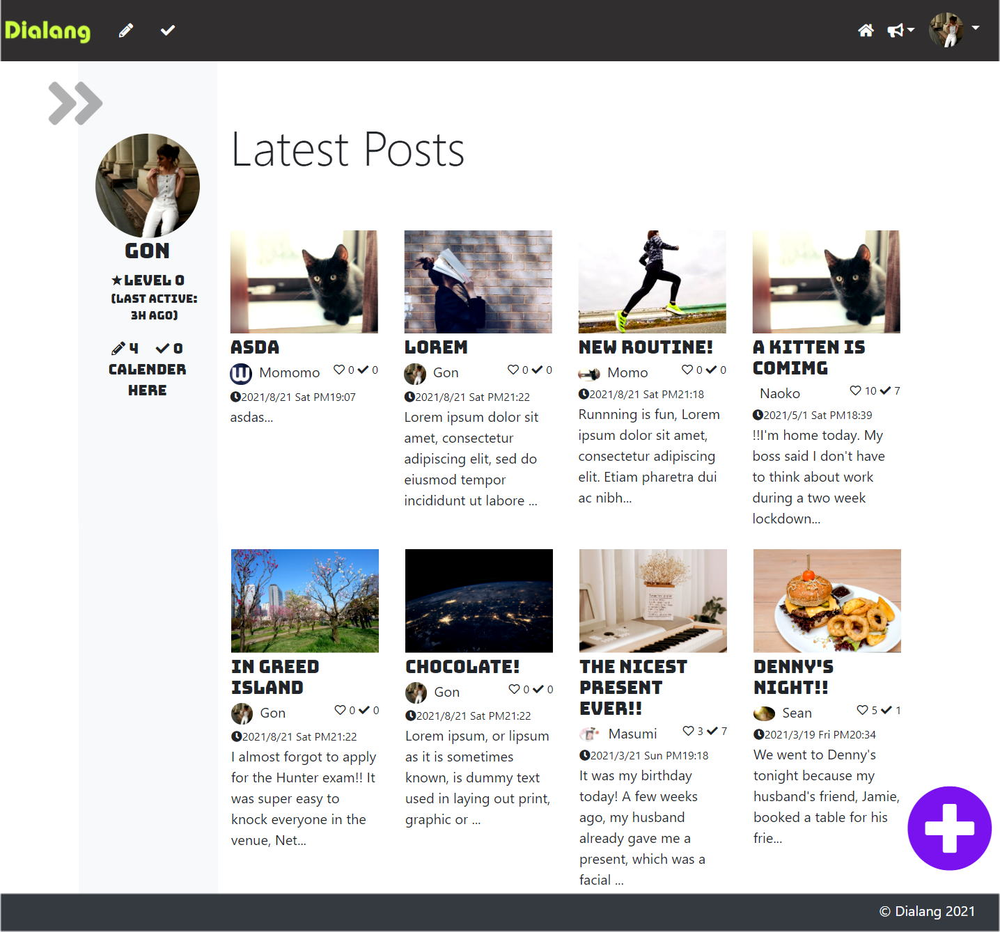
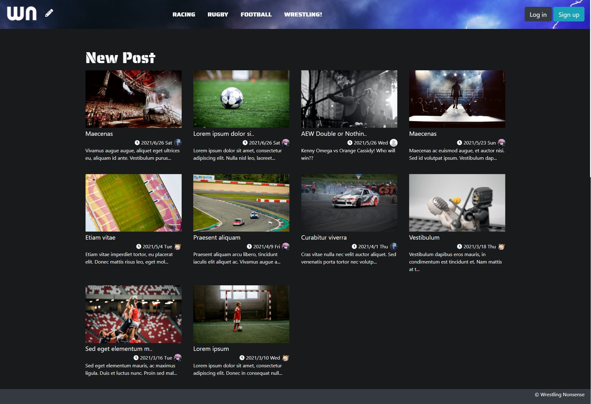
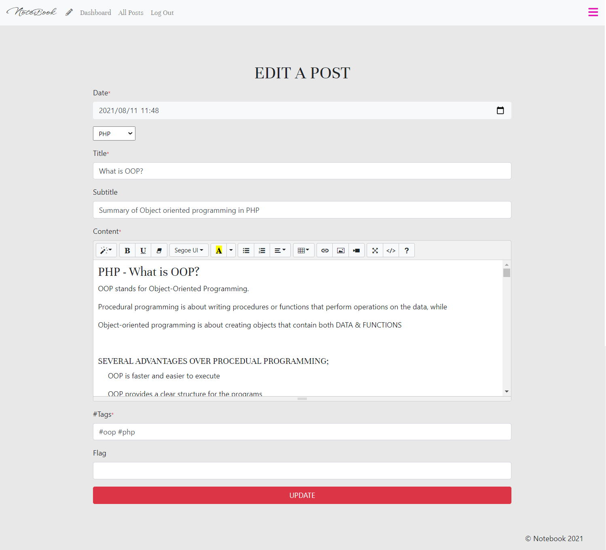
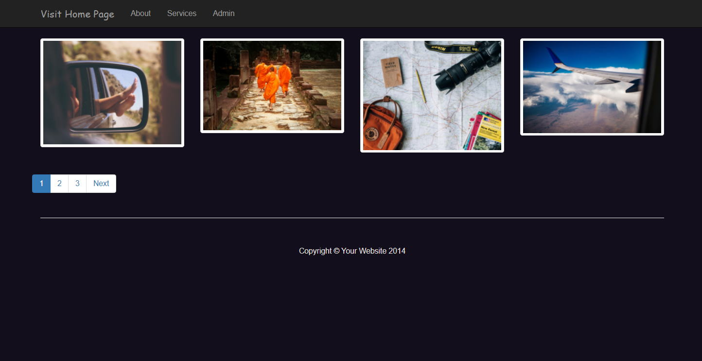

Hello! :white_heart:  Welcome to my PHP project repository. :rainbow::octocat: 
Here are some source files of my PHP projects. I have put my code files into here to show my coding skills for any potential employer. 
You can also have a look at the features on <strong>README file</strong> in the directory of each project. 

# Quick Explanations About My Projects

 <ul>
   <li>
      <h3>1. Dialang :earth_asia:</h3>
      
My first CMS website. To create this I used my skills mainly learned on a Udemy course named 'CMS Project Course - Master PHP.' I used procedural PHP here.  
      The reason I made this is I wanted to create a website where you can learn languages whilst interacting with each other.   

      
   </li>
 
   <li>
      <h3>2. Wrestling Nonsense :facepunch:</h3>
      
Also a CMS web site with quite similar functionality to Dialang, but this project also includes newly added functions such as 'Create Category' and 'Search.' This website is designed for simply posting reviews of any sporting events.  
  
      
   </li>
 
 <li>
      <h3>3. notebook :closed_book:</h3>
      
This project is kind of a blog for my computer studying. I created this whilst using OOP so that I could review what I learned from the OOP course. I add a new post here when I learn something new. I embeded Summernote in a form so I can freely customise the appearance of articles as I like. 
 
      
 </li>
 
 <li>
      <h3>4. Gallery :framed_picture:</h3>
      
I created this whilst learning a Udemy course named 'PHP: Object Oriented Programming for beginners + Project', which is focused on Object Oriented PHP. From the course, I learned the concept of OOP and how to use it in practice, writing all codes whilst making sure I understood each lecture.

      
 </li>
 
 

 <!-- <li>
      <h3>5. Translation Works</h3>
      
As an English speaker as one's second language, I sometimes enjoy to translate from English into Japanese, or visa versa. This site is kind of a notebook for myself to review my English studying. In future years, I'd like to enjoy writing as a hobby in various topics.

 </li> -->
 
</ul>

# PHP Learning History :woman_student:

<ul>
   <li><strong>Lately I've been studying a course 'PHP with Laravel for beginners - Become a Master in Laravel' on Udemy</strong> :woman_office_worker::fire:</li>
   <li>July      : Completed a course 'PHP: Object Oriented Programming for beginners + Project' on Udemy</li>
   <li>March     : Completed a course 'CMS Project Course - Master PHP' on Udemy</li>
</ul>
<h3>In 2020</h3>
 <ul>
   <li>October   : Started to learn PHP by self-study</li>
   <li>November  : Completed a course 'PHP Getting Started' on Pluralsight</li>
   <li>December  : Completed a course 'PHP Fundamentals' on Pluralsight</li>
 </ul>

