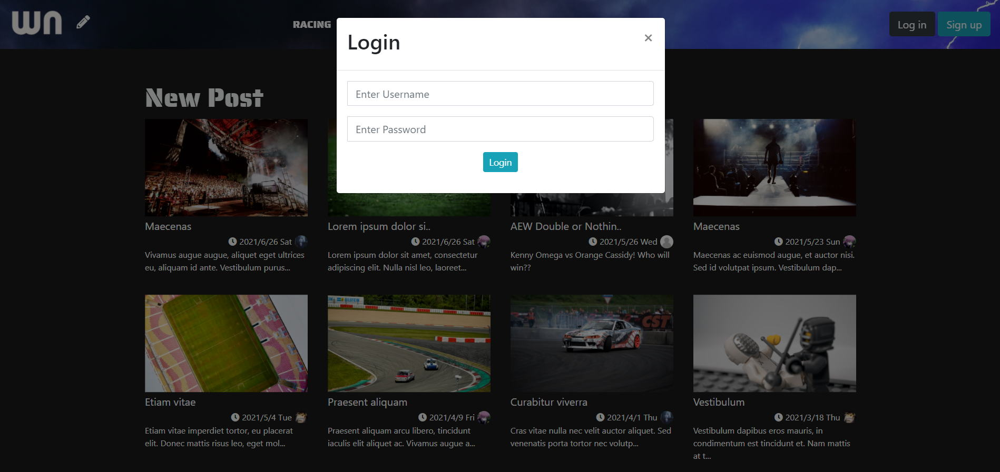
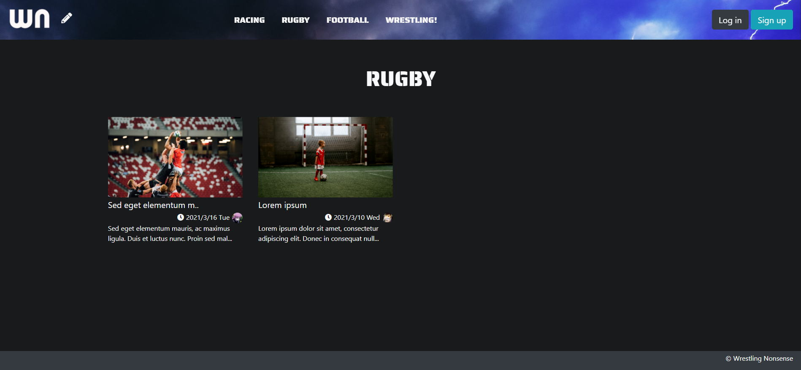
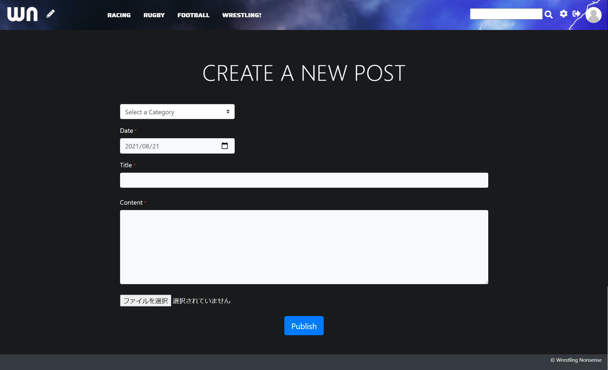
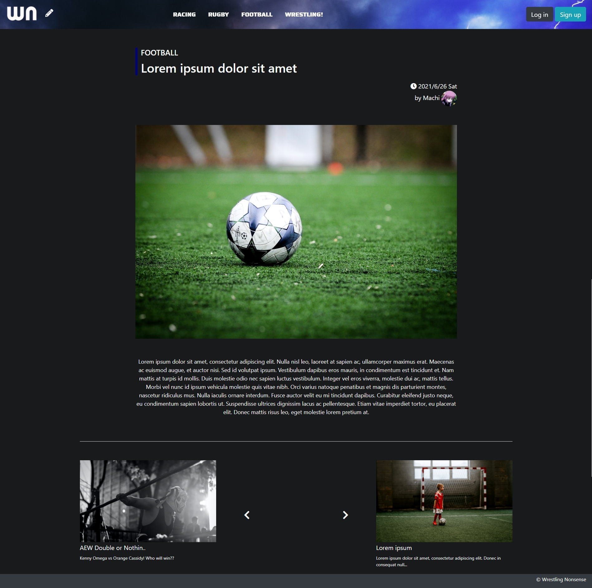
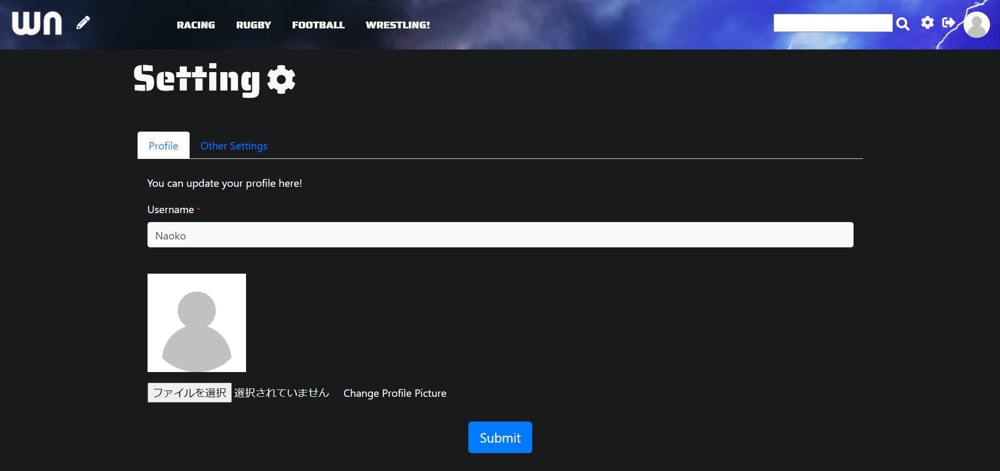
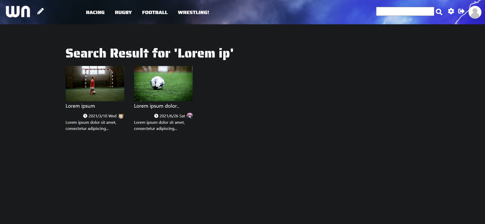

<h2>MENU</h2>
    

        <a href="#about">1. About This Project</a>
        <a href="#features">2. Features</a>
        <a href="#built_with">3. Built With</a>
    

    <h1>About this project</h1>
    <h2>#Wrestling Nonsense</h2>
    
This is my original PHP project named "Wrestling Nonsense".  This is a CMS project, designed for simply posting reviews of any sporting events. 

    <h2>This project is including the following features</h2>
    <h3 style="margin-top: 30px;">1. User Authentification</h3>
    <ul>
        <li>Signing up</li>
        <li>
            Logging in
            

</li>
        <li>Logging out</li>
    </ul>
     
    
    <h3 style="margin-top: 30px;">2. Posts</h3>
    <ul>
        <li>
            View all posts
            

        </li>
        <li>View all posts in a selected category
            

        </li>
        <li>
            Create a post
            

        </li>
        
        <li>Edit your post</li>
        <li>Delete with confirmation</li>
        <li>Jump to the next/previous post
            

        </li>
    </ul>
     
    
    <h3 style="margin-top: 30px;">3. Setting</h3>
    <ul>
        <li>You can set your profile picture and username</li>
        <li>You can also edit them if you want
            

        </li>
    </ul>
     
    <h3 style="margin-top: 30px;">4. Category</h3>
    <ul>
        <li>You can create, edit and delete a new category</li>
        <li>The categories will be on the navigation bar
            

        </li>
    </ul>
     
    
    <h3 style="margin-top: 30px;">5. Search</h3>
    <ul>
        <li>You can search a post by a keyword</li>
        <li>The result will include all the posts that have the keyword in their title or content.
            

        </li>
    </ul>
     

 
    <h2>Built with</h2>
    <ul>
        <li>HTML</li>
        <li>CSS</li>
        <li>Bootstrap</li>
        <li>Procedual PHP (I had not learned Object oriented PHP at that time)</li>
    </ul>

   
