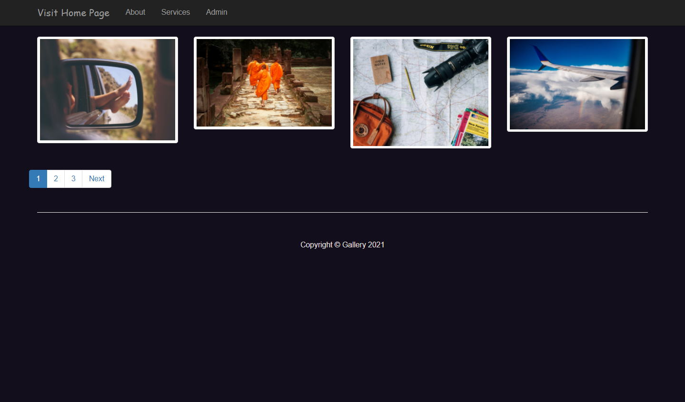
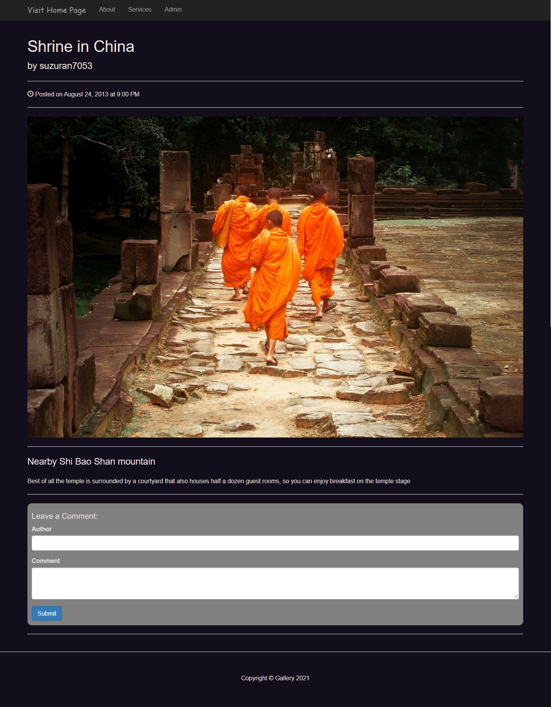

<h1>My gallery :framed_picture:</h1><h2>MENU</h2>
<a href="#about">1. About This Project</a> <a href="#built_with">2. Built With :gear:</a> <a href="#features">3. Features</a> 

<h2>About this project</h2>
This project is the one I created whilst learning a Udemy course named 'PHP: Object Oriented Programming for beginners + Project.' I completed this course in July 2021. From the course, I learned the concept of OOP and how to use it in practice, writing all codes whilst making sure I understood each lecture.

<h2>Built with :gear:</h2><ul><li>HTML</li><li>CSS</li><li>Bootstrap</li><li>Javascript / jQuery</li><li>Object Oriented PHP</li></ul>

<h2>Features</h2>
This project is including the following features
<h3 style="margin-top: 30px;">1. Home</h3><ul><li>View all photos

</li><li>View a post

</li><li>Pagenation

</li></ul><h3 style="margin-top: 30px;">2. User Authentification</h3><ul><li>Logging in and loggin out

</li></ul><h3 style="margin-top: 30px;">3. Admin Page</h3><ul><li>Dashboard<ul><li>Counters (views, photos, users and comments)</li><li>Google Piechart

</li><li>Upload Photo

</li><li>Users list

</li></ul></li></ul>
 
