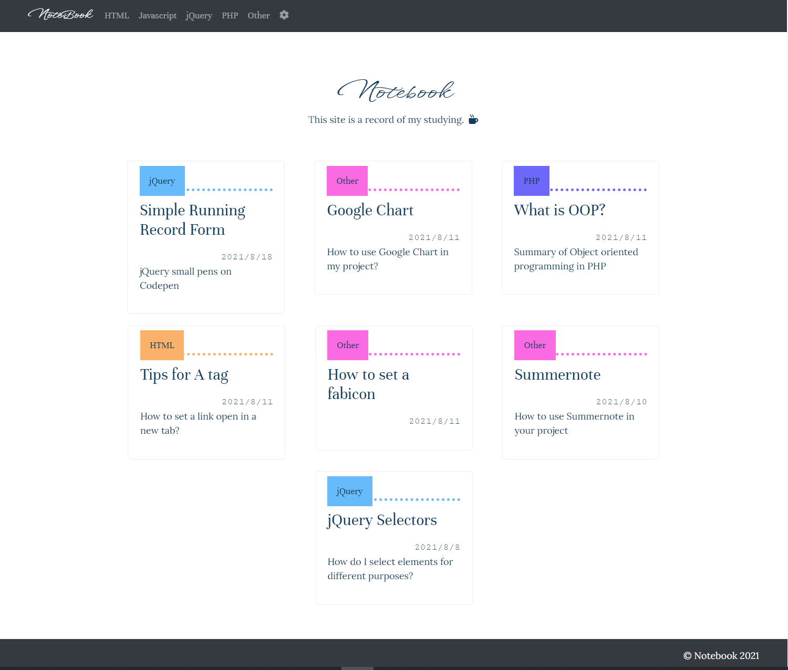
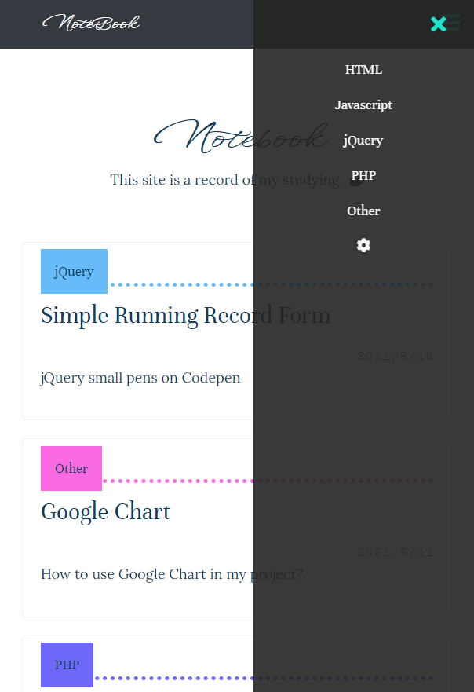
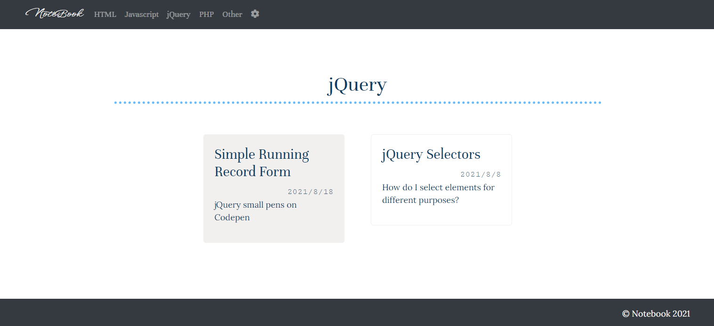
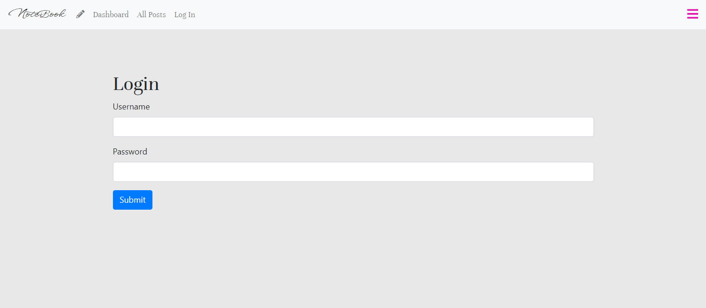
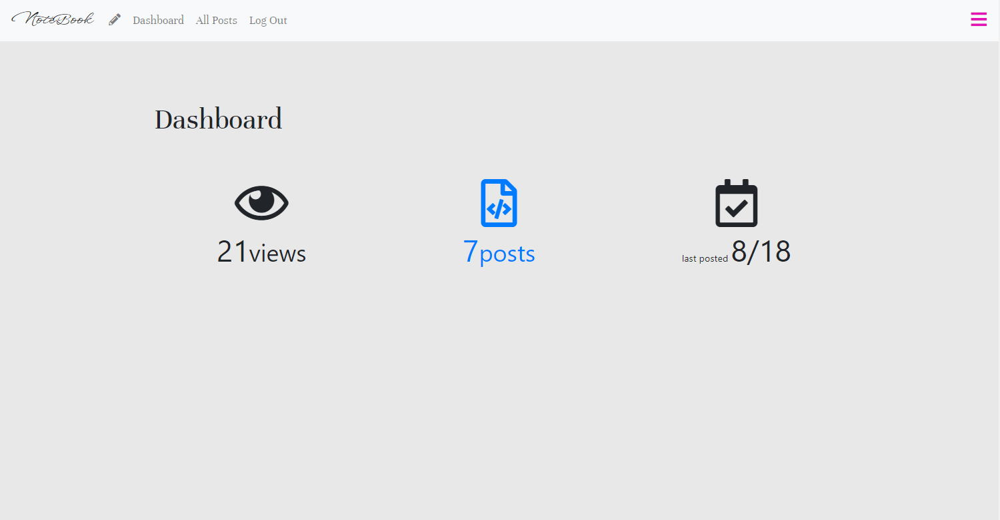
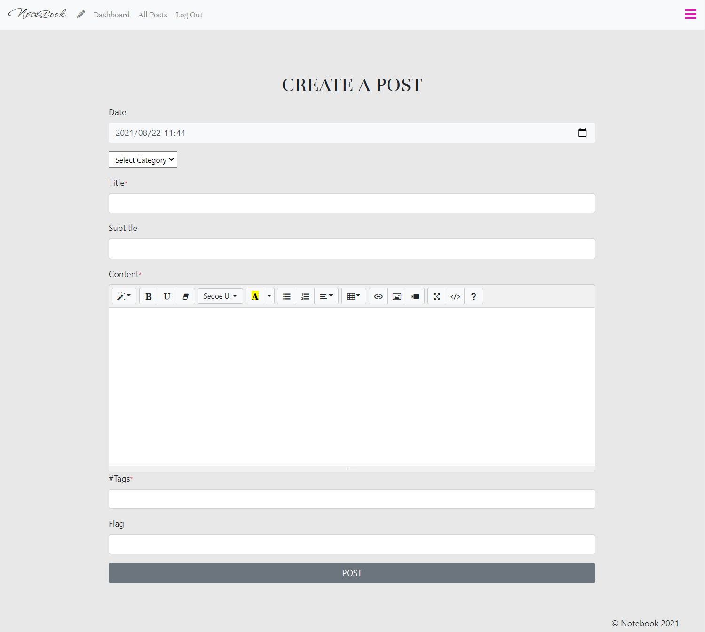

<h1>My notebook :closed_book:</h1><h2>MENU</h2>
<a href="#about">1. About This Project</a> <a href="#built_with">2. Built With :gear:</a> <a href="#features">3. Features</a> 

<h2>About this project</h2>
This is my original PHP project named "notebook".  This project is kind of a blog for my computer studying. I created this whilst using Object Oriented PHP so that I could review what I learned from the OOP course on Udemy, which is I completed in July 2021. :woman_student: I add a new post here when I learn something new! I embeded Summernote in a form so I can freely customise the appearance of articles as I like.

<h2>Built with :gear:</h2><ul><li>HTML</li><li>CSS</li><li>Bootstrap</li><li>Javascript / jQuery</li><li>Object Oriented PHP</li></ul>

<h2>Features</h2>
This project is including the following features
<h3 style="margin-top: 30px;">1. Home</h3><ul><li>View all posts<ul><li>Desktop

</li><li>Responsive

</li></ul></li><li>View a post

</li><li>Filter by category

</li><ul><h3 style="margin-top: 30px;">2. Admin Page</h3><ul><li>Logging in and loggin out<ul><li>I only can access to the admin page</li></ul>

</li><li>Dashboard

</li><li>Post Manipulation<ul><li>Create a post

</li><li>Edit a post

</li></ul></li></ul>
 

<!--
<h3 style="margin-top: 30px;">3. User Page</h3><ul><li>View all users list<ul><li>You can jump to other users' profile page from here</li></ul>

</li><li>Visit MyPage<ul><li>This page contains your profile information that you can edit and all the posts you made </li><li>You only can see 'edit' and 'delete' buttons next to each post only if it is your MyPage.</li><ul>

</li></ul> <h3 style="margin-top: 30px;">4. Setting</h3><ul><li>You can set your profile</li><li>You can change:<ul><li>profile picture</li><li>username</li><li>email address for logging in</li><li>native language</li><li>target language</li><li>profile comment</li></ul></li>

</li></ul> 
  
<h3 style="margin-top: 30px;">4. Category</h3><ul><li>You can create, edit and delete a new category</li><li>The categories will be on the navigation bar

</li></ul> <h3 style="margin-top: 30px;">5. Search</h3><ul><li>You can search a post by a keyword</li><li>The result will include all the posts that have the keyword in their title or content.

</li></ul> 
-->
